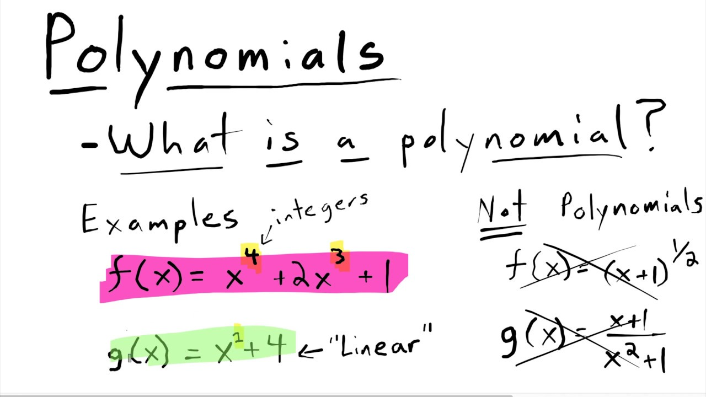

# POlynomials
In mathematics, a polynomial is an expression consisting of indeterminates and coefficients, that involves only the operations of addition, subtraction, multiplication, and positive-integer powers of variables. An example of a polynomial of a single indeterminate x is x² − 4x + 7.

